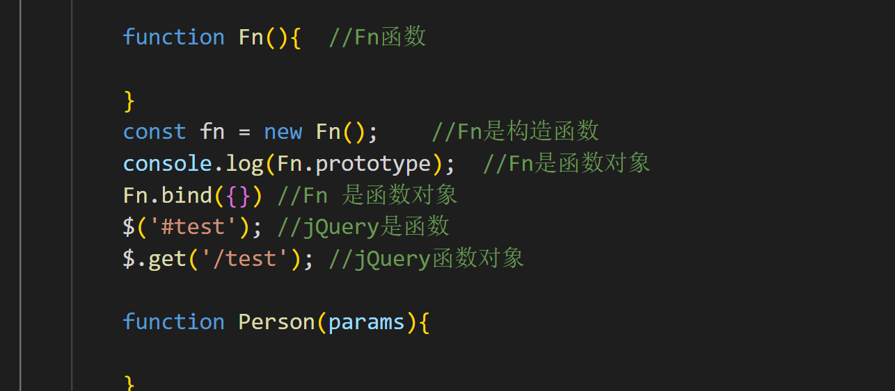
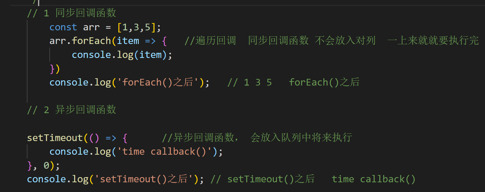
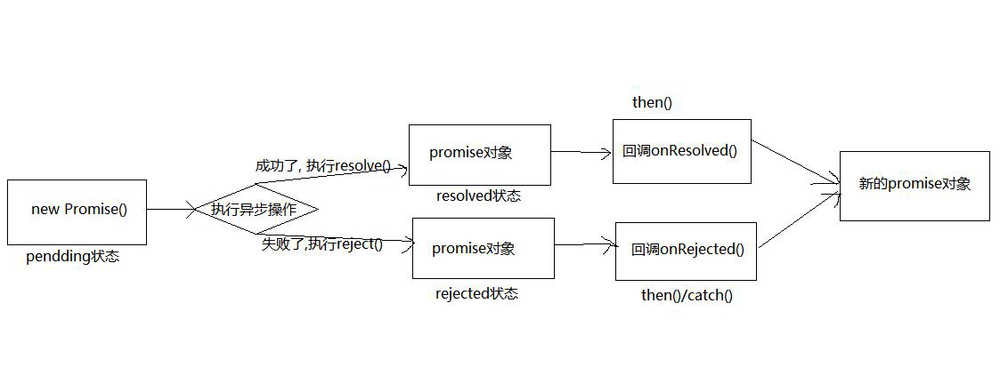
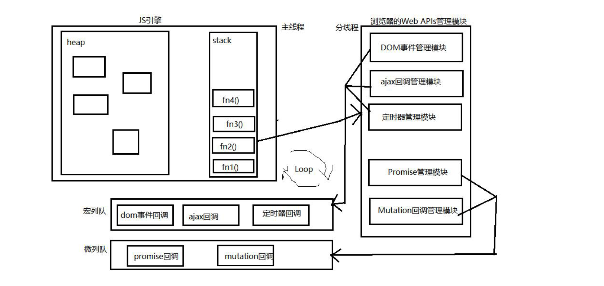

## 第一章 准备

### 1.1 区别实例对象与函数对象

**1 实例对象**： new函数产生的对象，称为实例对象，简称为对象

**2 函数对象**： 将函数作为对象使用时，简称为函数对象




### 1.2 二种类型的回调函数

#### 同步回调

1. **理解：立即只想，完全执行完了才结束，不会放入回调队列中**
2. **例子： 数组遍历相关的回调函数/Promise的excutor函数**

#### 异步回调

1.  **理解：不会立即执行，会放入回调队列中将来执行**

2.  **例子: 定时器回调  /Ajax回调 /  Promise的成功|失败的回调**
3.  

   


#### 1.3.1 错误的类型

1. Error: 所有错误的父类型
2. ReferenceError: 引用的变量不存在
3. TyoeError: 数据类型不正确的错误
4. RangeError: 数据值不在其所允许的范围内
5. SyntaxError: 语法错误

#### 1.3.2 错误处理

1. 捕获错误： try...catch
2. 抛出错误：throw error

#### 1.3.3 错误对象

​	1.message属性： 错误相关信息

​	2.stack属性： 函数调用栈记录信息

## 第二章 promise的理解和使用


### 2.1 promise是什么

#### 2.1.1 理解

##### 1 抽象表达

Promise是Js是中进行异步编程的新的解决方案（旧的是谁？）

##### 2 具体表达

(1) 从语法上来说: Promise是一个构造函数

(2) 从功能上来说： promise 对象用来封装一个异步操作并获取其结果

#### 2.1.2promise的状态改变

1 pendding 变为resolved

2 pendding 变为rejected

**说明：**只有这2种，且一个promise对象只能改变一次

​			无论变为成功还是失败，都会有一个结果数据

​			成功的结果数据一般称为value，失败的额结果称为reason

#### 2.1.3.promise的基本流程



#### 2.1.4.promise的基本使用

``` js
//1 创建一个新的Promise对象
        const p = new Promise((resolve, reject)=>{//执行器函数
            //2 执行异步操作任务
            setTimeout(()=>{
                const time = Date.now()//如果当前时间是偶数就代表成功,否则代表失败
                //3.1 如果成功了，调用resolve(value)
                if(time % 2 == 0){
                    resolve('成功的数据,time: ' + time);
                }else{
                    
                    //3.2 如果失败了，调用reject(reason)
                    reject('失败的数据, time=: '+ time);
                }
            }
            ,1000);
            
            
        });
        p.then(
            value =>{//接收得到成功的数据    onResolved
                console.log('成功的回调', value);
            },
            reason =>{//接收得到失败的reason数据  onRejected
                console.log('失败的回调', reason);

            }
        )
   
```


### 2.2 为什么要用Promise?

#### 2.2.1 指定回调函数的方式更加灵活

1. 旧的：必须在启动异步任务前指定
2. promise: 启动异步任务 => 返回promise 对象 => 给promise 对象绑定回调函数（甚至可以在异步任务结束后指定/多个）


#### 2.2.2 支持链式调用，可以解决回调地狱问题

##### 1 什么是回调地狱？

​	回调函数嵌套调用，外部回调函数异步执行的结果是嵌套的回调执行的条件

##### 2 回调地狱的缺点？

​	不方便阅读

​	不便于异常处理

##### 3 解决方案

​	promise链式调用

##### 4 终极解决方案

​	async/await


### 2.3 如何使用Promise?

#### 2.3.1 API

##### 1 

Promise构造函数：Promise(excutor){}

1. excutor函数：执行器（resolve,reject）=>{}

2. resolve 函数：内部定义成功时我们调用的函数value=>{}

3. reject函数：内部定义失败时我们调用的函数reason=>{}

   **说明**：excutor会在Promise内部立即同步回调，异步操作在执行器种执行

##### 2

 Promise.prototype.then方法（onResolved, onRejected）=>{}

1. onResolved 函数: 成功的回调函数(value) => {}

2. onRejected 函数: 失败的回调函数(reason) => {}

   **说明**: 指定用于得到成功value 的成功回调和用于得到失败reason 的失败回调返回一个新的promise 对象

##### 3

 Promise.prototype.catch 方法: (onRejected) => {}
 1  onRejected 函数: 失败的回调函数(reason) => {}
说明: then()的语法糖, 相当于: then(undefined, onRejected)

##### 4

Promise.resolve 方法: (value) => {}
(1) value: 成功的数据或promise 对象
说明: 返回一个成功/失败的promise 对象

##### 5

Promise.reject 方法: (reason) => {}
(1) reason: 失败的原因
说明: 返回一个失败的promise 对象

##### 6

Promise.all 方法: (promises) => {}
(1) promises: 包含n 个promise 的数组
说明: 返回一个新的promise, 只有所有的promise 都成功才成功, 只要有一个失败了就
直接失败

##### 7

Promise.race 方法: (promises) => {}
(1) promises: 包含n 个promise 的数组
说明: 返回一个新的promise, 第一个完成的promise 的结果状态就是最终的结果状态

#### 2.3.2. promise的几个关键问题

##### 如何改变promise 的状态?

(1) resolve(value): 如果当前是pendding 就会变为resolved
(2) reject(reason): 如果当前是pendding 就会变为rejected
(3) 抛出异常: 如果当前是pendding 就会变为rejected

##### 一个promise 指定多个成功/失败回调函数, 都会调用吗?

当promise 改变为对应状态时都会调用

##### 改变promise 状态和指定回调函数谁先谁后?

(1) 都有可能, 正常情况下是先指定回调再改变状态, 但也可以先改状态再指定回调
(2) 如何先改状态再指定回调?
1 在执行器中直接调用resolve()/reject()
2 延迟更长时间才调用then()
(3) 什么时候才能得到数据?
1 如果先指定的回调, 那当状态发生改变时, 回调函数就会调用, 得到数据
2 如果先改变的状态, 那当指定回调时, 回调函数就会调用, 得到数据

##### promise.then()返回的新promise 的结果状态由什么决定?

(1) 简单表达: 由then()指定的回调函数执行的结果决定

(2) 详细表达:
1 如果抛出异常, 新promise 变为rejected, reason 为抛出的异常
2 如果返回的是非promise 的任意值, 新promise 变为resolved, value 为返回的值
3 如果返回的是另一个新promise, 此promise 的结果就会成为新promise 的结果

##### promise 如何串连多个操作任务?

(1) promise 的then()返回一个新的promise, 可以开成then()的链式调用
(2) 通过then 的链式调用串连多个同步/异步任务

##### promise 异常传透?

(1) 当使用promise 的then 链式调用时, 可以在最后指定失败的回调,
(2) 前面任何操作出了异常, 都会传到最后失败的回调中处理

##### 中断promise 链?

(1) 当使用promise 的then 链式调用时, 在中间中断, 不再调用后面的回调函数
(2) 办法: 在回调函数中返回一个pendding 状态的promise 对象

## 第三章 自定义（手写）Promise

### 3.1 定义整体结构


### 3.2 Promise构造函数的实现


### 3.3 promise.then()/catch()的实现


### 3.4 promise.resolve()/reject()的实现


### 3.5 Promise.all/race()的实现


### 3.6 Promise.resolveDelay()/rejectDelay()的实现


### 3.7 ES5 function 完整版本


### 3.8 ES6 class 完整版


## 第四章 async与await

### 4.1mdn文档

 

### 4.2 async函数

1. 函数的返回值是promise对象
2. promise对象的结果由async函数执行的返回值决定

### 4.3 await表达式

1. await右侧的表达式一般为promise对象，但也可以是其他的值
2. 如果表达式promise对象，await返回的是promise成功的值
3. 如果表达式是其他值，直接将此值作为await的返回值

await必须写在async函数中 但async函数中可以没有await

如果await的promise失败了，就会抛出异常，需要通过try...catch来捕获处理

## 第五章 JS异步之宏队列与微队列

### 5.1 原理



### 5.2说明


1. JS 中用来存储待执行回调函数的队列包含2 个不同特定的列队
2. 宏列队: 用来保存待执行的宏任务(回调), 比如: 定时器回调/DOM 事件回调/ajax 回调
3. 微列队: 用来保存待执行的微任务( 回调), 比如: promise 的回调/MutationObserver 的回调
4. JS 执行时会区别这2 个队列
(1) JS 引擎首先必须先执行所有的初始化同步任务代码
(2) 每次准备取出第一个宏任务执行前, 都要将所有的微任务一个一个取出来执行


## 第六章 Promise相关面试题

``` js
<script>
        setTimeout(() => {
            console.log(1);
        }, 0);
        Promise.resolve().then(()=>{
            console.log(2);
        })
        Promise.resolve().then(()=>{
            console.log(4);
        })
        console.log(3);
</script>
```


